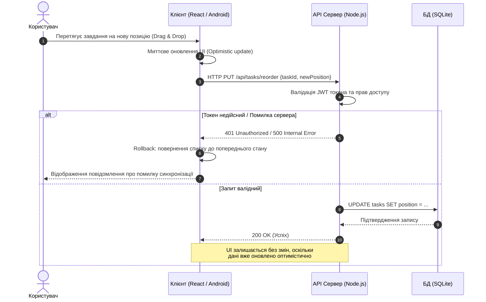
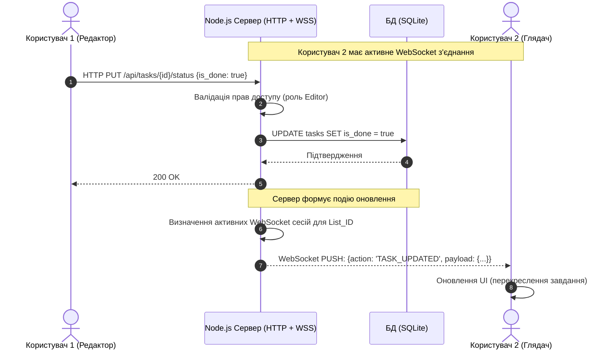

## 5. Відображення User Stories у UML-нотації 

У цьому розділі наведено UML-діаграми послідовності для ключових користувацьких сценаріїв. Діаграми ілюструють взаємодію між користувачами та компонентами системи (Клієнт, Сервер, База даних), включаючи альтернативні потоки виконання.

### 5.1. Сценарій 1: Інтерактивне сортування завдань (US-01)
**Опис:** Ця діаграма відображає процес зміни пріоритету завдання за допомогою Drag & Drop з використанням концепції **Optimistic UI**. Інтерфейс оновлюється миттєво, а у разі збою на сервері відбувається rollback до попереднього стану.

### 5.2. Сценарій 2: Колективна робота в реальному часі (US-02)
**Опис:** Діаграма демонструє, як зміна статусу завдання одним користувачем (Редактором) миттєво транслюється іншому користувачу (Глядачу) через WebSocket.

