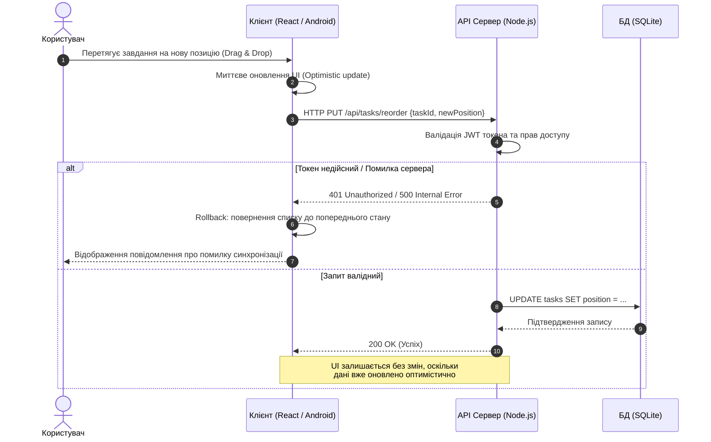
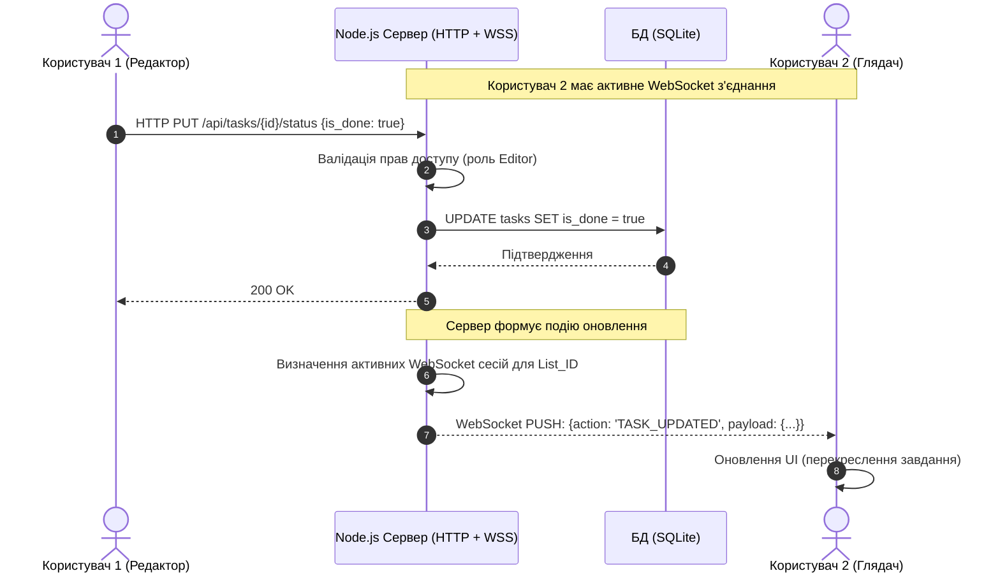
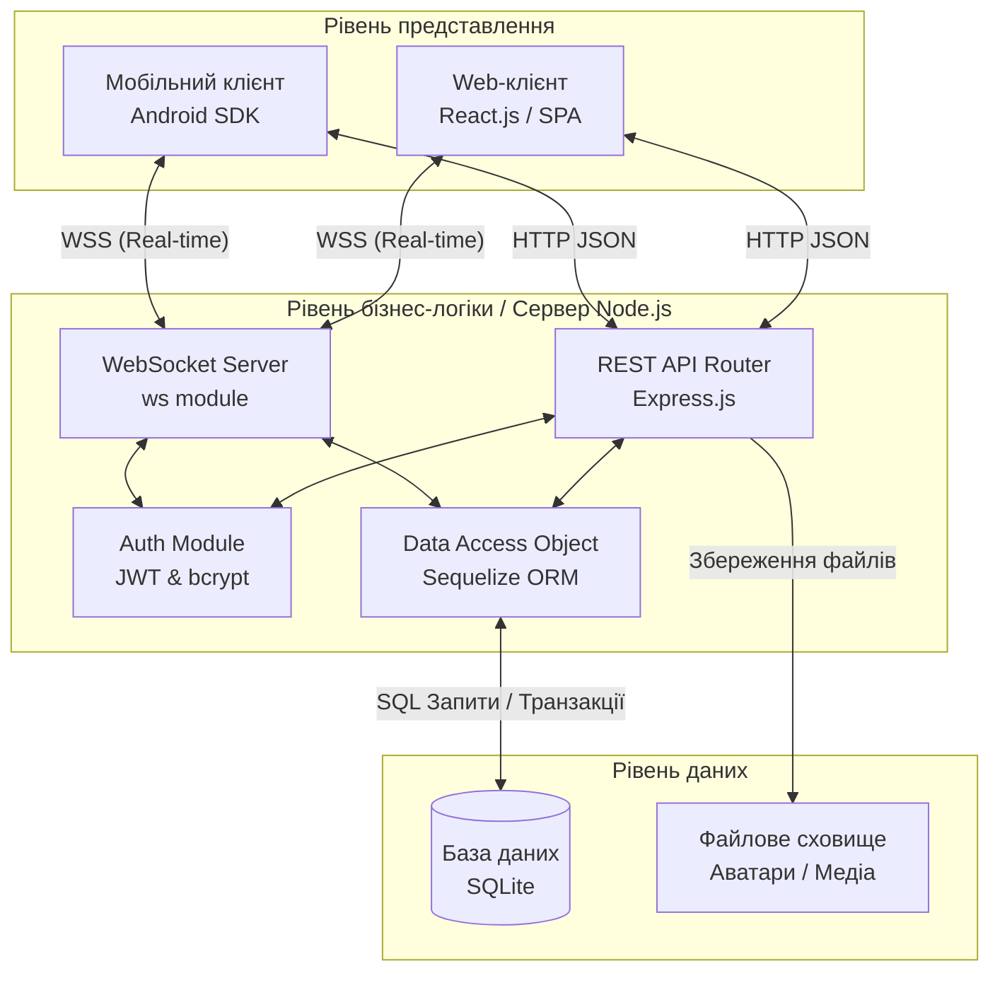
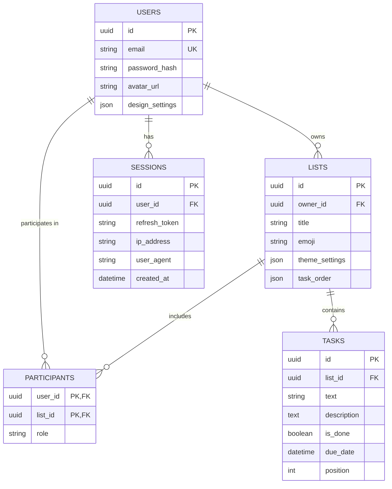

# ПРОЄКТНА ДОКУМЕНТАЦІЯ 
**З дисципліни «Системний аналіз та проєктування інформаційних систем»**

**Тема проєкту:** Інформаційна система управління завданнями «To-Do Pro»

**Виконав:** студент Дмитро Лебедєв

---

## Анотація проєкту

### 1. Мета проєкту
Спроєктувати архітектуру, розробити логічну структуру та підготувати вичерпну документацію для кросплатформеної інформаційної системи управління завданнями «To-Do Pro», яка підтримує колективну роботу в режимі реального часу та забезпечує глибоку персоналізацію робочого простору.

### 2. Завдання проєкту
1. Провести збір та аналіз вимог предметної області тайм-менеджменту.
2. Сформулювати функціональні та нефункціональні вимоги до веб- та мобільного клієнтів.
3. Визначити рольову модель та матрицю доступу для учасників системи.
4. Розробити користувацькі сценарії (User Stories) та зобразити їх за допомогою UML.
5. Спроєктувати клієнт-серверну архітектуру та реляційну модель бази даних (SQLite).
6. Обґрунтувати вибір технологічного стеку та методології розробки (Agile/Scrum).
7. Сформувати вимоги до інформаційної безпеки та масштабування.

### 3. Короткий опис системи
**«To-Do Pro»** це сучасний Task Manager, побудований за клієнт-серверною архітектурою. Бекенд реалізовано на платформі Node.js із використанням фреймворку Express.js та Sequelize ORM. Клієнтська частина представлена вебдодатком на React.js (SPA) та нативним мобільним додатком для Android. Ключовою особливістю системи є використання протоколу WebSocket для миттєвої синхронізації змін між користувачами, а також впровадження концепції Optimistic UI для забезпечення максимальної швидкодії інтерфейсу.

---

## ЗМІСТ ДОКУМЕНТАЦІЇ

1. [Обстеження предметної області](#1-обстеження-предметної-області)
2. [Функціональні та нефункціональні вимоги](#2-функціональні-та-нефункціональні-вимоги)
3. [Визначення користувачів системи](#3-визначення-користувачів-системи)
4. [Функціональні сценарії (User Stories)](#4-функціональні-сценарії-user-stories)
5. [Відображення User Stories у UML-нотації](#5-відображення-user-stories-у-uml-нотації)
6. [Архітектура системи та залежності](#6-архітектура-системи-та-залежності)
7. [Побудова моделі даних](#7-побудова-моделі-даних)
8. [Обґрунтування вибору типу бази даних](#8-обґрунтування-вибору-типу-бази-даних)
9. [Аналіз можливостей масштабування](#9-аналіз-можливостей-масштабування)
10. [Аналіз системи безпеки](#10-аналіз-системи-безпеки)
11. [Перспективи розвитку системи](#11-перспективи-розвитку-системи)
12. [Обґрунтування методології розробки](#12-обґрунтування-методології-розробки)
14. [Аналіз циклів зворотного зв'язку в системі](#14-аналіз-циклів-зворотного-зв'язку-в-системі)
15. [Визначення артефактів системи](#15-визначення-артефактів-системи)
16. [Точки впливу на систему](#16-точки-впливу-на-систему)

---

## 1. Обстеження предметної області

### 1.1. Опис предметної області
Предметною областю є процеси персонального тайм-менеджменту та колективного управління завданнями (Task Management). У зв'язку зі зростанням обсягів інформації, користувачі потребують інструментів для декомпозиції цілей, пріоритезації завдань та командної взаємодії. Традиційні системи часто страждають від затримок мережевої синхронізації, що знижує ефективність спільної роботи.

### 1.2. Основні бізнес-процеси
Під час обстеження предметної області виділено наступні ключові бізнес-процеси, які має автоматизувати система:
1. **Управління користувацьким доступом:** Реєстрація, багатосесійна авторизація, контроль активних пристроїв.
2. **Організація робочого простору:** Створення списків завдань, їх кастомізація (колір, іконка, фон) та структурування.
3. **Управління життєвим циклом завдання (Task Lifecycle):** Створення, редагування, зміна статусу (виконано/не виконано), встановлення дедлайнів, видалення.
4. **Спільна робота (Collaboration):** Надання доступу до списків іншим користувачам (режим читання або редагування) через генерацію посилань-запрошень.
5. **Динамічна синхронізація:** Миттєве оновлення даних на всіх активних пристроях користувачів, які працюють зі спільним списком.

---

## 2. Функціональні та нефункціональні вимоги

Функціональні вимоги визначають поведінку системи та сервіси, які вона надає кінцевому користувачу (як у веб-версії, так і в мобільному додатку Android).

### 2.1. Модуль авторизації та управління профілем
* **REQ-F-01:** Система повинна дозволяти користувачу реєструватися та авторизуватися за допомогою електронної пошти та пароля.
* **REQ-F-02:** Система повинна підтримувати паралельні сесії для одного користувача з різних пристроїв.
* **REQ-F-03:** Користувач повинен мати можливість переглядати список активних сесій та дистанційно завершувати їх.
* **REQ-F-04:** Користувач повинен мати можливість завантажувати та змінювати аватар профілю.

### 2.2. Модуль управління списками та завданнями
* **REQ-F-05:** Система повинна забезпечувати виконання CRUD-операцій для списків завдань.
* **REQ-F-06:** Система повинна забезпечувати виконання CRUD-операцій для окремих завдань всередині списку.
* **REQ-F-07:** Система повинна підтримувати зміну порядку списків та завдань за допомогою механізму Drag & Drop із збереженням нового порядку в базі даних.
* **REQ-F-08:** Користувач повинен мати можливість налаштовувати візуальне оформлення списку (фонові зображення, ефекти розмиття).

### 2.3. Модуль колективної роботи
* **REQ-F-09:** Система повинна генерувати унікальні посилання (UUID) для надання доступу до списку.
* **REQ-F-10:** Система повинна підтримувати рольову модель доступу до списків: `Admin` (власник), `Editor` (редагування), `Viewer` (тільки читання).
* **REQ-F-11:** При переході за посиланням-запрошенням система повинна відображати інформацію про власника списку перед підтвердженням вступу.

Нефункціональні вимоги визначають критерії якості програмного продукту, його продуктивність та архітектурні атрибути.

### 3.1. Вимоги до продуктивності (Performance)
* **REQ-NF-01 (Швидкодія UI):** Інтерфейс клієнтських додатків повинен використовувати патерн **Optimistic UI**. Візуальне відображення дій користувача (наприклад, зміна статусу завдання) має відбуватися миттєво (до 50 мс), не чекаючи підтвердження від сервера.
* **REQ-NF-02 (Латентність синхронізації):** Затримка передачі оновлень між пристроями через WebSocket не повинна перевищувати 200 мс у межах стабільного інтернет-з'єднання.
* **REQ-NF-03 (Завантаження):** Час холодного старту веб-додатка не повинен перевищувати 1.5 секунди.

### 3.2. Вимоги до безпеки (Security)
* **REQ-NF-04 (Автентифікація):** Авторизація запитів повинна здійснюватися виключно через стандартизовані JWT (JSON Web Tokens).
* **REQ-NF-05 (Шифрування):** Паролі користувачів повинні хешуватися за допомогою алгоритму `bcrypt` із використанням "солі". Передача даних має здійснюватися через захищені протоколи (HTTPS, WSS).
* **REQ-NF-06 (Захист від атак):** Серверна частина повинна бути захищена від SQL-ін'єкцій шляхом використання ORM-системи для взаємодії з БД.

### 3.3. Вимоги до надійності (Reliability)
* **REQ-NF-07 (Відновлення з'єднання):** Клієнтські додатки повинні автоматично відновлювати WebSocket-з'єднання у разі обриву мережі без втрати поточного стану.
* **REQ-NF-08 (Цілісність даних):** При видаленні списку завдань система повинна гарантувати каскадне видалення всіх вкладених завдань та записів про учасників на рівні транзакцій БД.

## 3. Визначення користувачів системи

Для забезпечення гнучкості та безпеки інформаційної системи «To-Do Pro» реалізовано дворівневу модель управління доступом: ролі на рівні всієї системи (глобальні актори) та ролі на рівні конкретного об'єкта (спільного списку завдань).

### 3.1. Глобальні групи користувачів

1. **Неавторизований користувач (Гість)**
   * **Відповідальність:** Дотримання загальних правил використання публічних ресурсів системи.
   * **Доступні функції:**
     * Реєстрація нового облікового запису та авторизація.
     * Відновлення доступу до акаунта (скидання пароля).
     * Перегляд публічних списків завдань за спеціальним згенерованим UUID-посиланням у режимі Read-only.
   * **Обмеження:** Не має доступу до створення контенту, перегляду профілів або участі в спільній роботі.

2. **Авторизований користувач (Базова роль)**
   * **Відповідальність:** Збереження конфіденційності своїх облікових даних (пароля) та управління власними активними сесіями.
   * **Доступні функції:**
     * Управління профілем (завантаження аватара, зміна пароля).
     * Моніторинг та дистанційне закриття активних сесій на інших пристроях.
     * Створення, редагування та видалення власних списків завдань.
     * Генерація посилань-запрошень для інших користувачів.
   * **Обмеження:** Доступ обмежений лише власними даними та тими спільними списками, куди користувача було запрошено.

3. **Системний адміністратор (Технічний персонал)**
   * **Відповідальність:** Забезпечення безперебійної роботи сервера (Node.js) та бази даних (SQLite), моніторинг безпеки.
   * **Доступні функції:**
     * Доступ до логів сервера.
     * Управління конфігураціями бази даних.
     * Примусове блокування скомпрометованих акаунтів (на рівні БД).
   * **Обмеження:** Взаємодіє з системою не через графічний інтерфейс (UI), а через серверне середовище.

---

### 3.2. Рольова модель доступу до спільних списків

Коли Авторизований користувач створює список, він стає його «Власником». При запрошенні інших користувачів через Invite-посилання, їм призначається одна з ролей для конкретного списку.

1. **Власник (Owner / Admin)**
   * **Опис:** Творець списку завдань.
   * **Права доступу:** Повний контроль. Тільки Власник може налаштовувати глобальний дизайн списку (шпалери, ефекти розмиття), видаляти весь список каскадно, генерувати посилання-запрошення та відкликати їх, а також видаляти інших учасників або змінювати їхні ролі.

2. **Редактор (Editor)**
   * **Опис:** Запрошений учасник із правами на спільну роботу.
   * **Права доступу:** Має право виконувати всі CRUD-операції над завданнями всередині списку (створювати нові задачі, редагувати опис, змінювати дедлайни, перемикати статус на «виконано»). Може використовувати Drag & Drop для зміни пріоритету завдань.
   * **Обмеження:** Не може видалити сам список, змінити його візуальну тему або запросити/видалити інших користувачів.

3. **Глядач (Viewer)**
   * **Опис:** Учасник, запрошений виключно для ознайомлення з ходом робіт.
   * **Права доступу:** Отримання оновлень через WebSocket у реальному часі.
   * **Обмеження:** Строгий Read-only. Жодні маніпуляції з даними неможливі.

---

### 3.3. Матриця прав доступу

Нижче наведено матрицю доступу для об'єкта «Список завдань» та його елементів.

| Дія | Гість (через публічний лінк) | Глядач (Viewer) | Редактор (Editor) | Власник (Owner) |
| :--- | :---: | :---: | :---: | :---: |
| **Перегляд завдань в реальному часі** | Так | Так | Так | Так |
| **Створення нового завдання** | Ні | Ні | Так | Так |
| **Зміна статусу/дедлайну завдання** | Ні | Ні | Так | Так |
| **Сортування завдань (Drag&Drop)** | Ні | Ні | Так | Так |
| **Зміна шпалер/дизайну списку** | Ні | Ні | Ні | Так |
| **Генерація запрошувальних посилань** | Ні | Ні | Ні | Так |
| **Видалення всього списку** | Ні | Ні | Ні | Так |

---

### 3.4. Обмеження безпеки та політика доступу (Security Constraints)

1. **Перевірка JWT на кожному запиті:** Доступ до будь-яких захищених маршрутів API сервера можливий лише за наявності валідного короткострокового JSON Web Token. Сервер також перевіряє наявність сесії в БД (`sessions table`), щоб запобігти використанню вкрадених токенів.
2. **Захист від перебору посилань:** Посилання для спільного доступу генеруються у форматі UUID v4 (наприклад, `123e4567-e89b-12d3-a456-426614174000`), що робить неможливим підбір посилань до чужих списків.
3. **Експірація запрошень:** Власник може встановлювати час життя (TTL) для посилань-запрошень (наприклад, посилання дійсне лише 24 години) або анулювати їх вручну.
4. **Валідація Optimistic UI:** Хоча інтерфейс користувача (React/Android) дозволяє виконувати дії миттєво для покращення UX, бекенд на базі Node.js здійснює жорстку перевірку ролі (Authorization Check) перед кожним записом у базу даних. Якщо користувач спробує обійти клієнтські обмеження, сервер поверне помилку `403 Forbidden`, а інтерфейс автоматично відкотиться до попереднього стану.
5. **Анулювання сесій:** При зміні пароля Авторизованим користувачем, система автоматично видаляє всі активні `refresh_tokens` з бази даних, миттєво позбавляючи доступу всі інші пристрої.

## 4. Функціональні сценарії (User Stories)

У цьому розділі функціональні вимоги до системи «To-Do Pro» описані з точки зору кінцевого користувача у форматі користувацьких історій. Це дозволяє краще зрозуміти цінність кожної функції для різних ролей.

### US-01: Інтерактивне сортування завдань (Пріоритезація)
* **Історія:** Як **Авторизований користувач**, я хочу мати можливість змінювати порядок завдань у списку за допомогою перетягування (Drag & Drop), щоб швидко пріоритезувати свої справи залежно від їхньої поточної важливості.
* **Критерії приймання:**
  * Користувач може схопити завдання мишею (на веб-клієнті) або довгим натисканням (на Android) і перетягнути його вище або нижче у списку.
  * Під час перетягування інтерфейс плавно анімує зміщення інших елементів.
  * Новий порядок миттєво зберігається на сервері та відображається на всіх інших пристроях користувача.

### US-02: Колективна робота в реальному часі
* **Історія:** Як **Редактор спільного списку**, я хочу миттєво бачити зміни (додавання, видалення, зміну статусу), внесені іншими учасниками команди, щоб уникнути дублювання роботи та завжди мати актуальну інформацію про стан проєкту.
* **Критерії приймання:**
  * Якщо один учасник позначає завдання як Виконане, воно миттєво (без перезавантаження сторінки) перекреслюється на екранах усіх інших активних учасників.
  * Синхронізація відбувається через WebSocket-з'єднання.
  * Якщо мережа тимчасово зникає, після її відновлення клієнт автоматично підтягує останні зміни з сервера.

### US-03: Зручне запрошення учасників
* **Історія:** Як **Власник списку**, я хочу генерувати унікальне посилання-запрошення для свого списку завдань, щоб швидко та зручно залучати колег чи друзів до спільної роботи без необхідності вручну вводити їхні email-адреси.
* **Критерії приймання:**
  * Власник може натиснути кнопку Поділитися та отримати посилання.
  * Власник може обрати роль для цього посилання: Редактор або Глядач.
  * При переході за посиланням інший користувач бачить сторінку попереднього перегляду (з ім'ям та аватаром власника) перед підтвердженням вступу.

### US-04: Глибока персоналізація робочого простору
* **Історія:** Як **Авторизований користувач**, я хочу налаштовувати візуальне оформлення свого робочого простору (встановлювати власні шпалери, регулювати рівень розмиття та затемнення фону), щоб створити комфортне середовище, яке відповідає моєму настрою та знижує зорове навантаження.
* **Критерії приймання:**
  * Користувач може вставити URL-посилання на будь-яке зображення для фону.
  * Інтерфейс містить повзунки для налаштування ефектів розмиття та затемнення.
  * Зміни дизайну застосовуються миттєво та зберігаються в базі даних (у полі `design_settings`).

### US-05: Безпека та управління пристроями
* **Історія:** Як **Авторизований користувач**, я хочу бачити список усіх пристроїв і браузерів, з яких зараз виконано вхід у мій акаунт, і мати можливість примусово завершити ці сесії, щоб гарантувати безпеку своїх даних у разі втрати смартфона або випадкового використання чужого комп'ютера.
* **Критерії приймання:**
  * У налаштуваннях профілю відображається список активних сесій (з вказанням IP-адреси, типу браузера/ОС та часу останньої активності).
  * Користувач може натиснути кнопку Завершити сесію навпроти конкретного пристрою.
  * Після цього сервер видаляє `refresh_token` цього пристрою з бази даних, і при наступній дії на тому пристрої користувача буде викинуто на сторінку логіну.

## 5. Відображення User Stories у UML-нотації

У цьому розділі наведено UML-діаграми послідовності для ключових користувацьких сценаріїв. Діаграми ілюструють взаємодію між користувачами та компонентами системи (Клієнт, Сервер, База даних), включаючи альтернативні потоки виконання.

### 5.1. Сценарій 1: Інтерактивне сортування завдань (US-01)
**Опис:** Ця діаграма відображає процес зміни пріоритету завдання за допомогою Drag & Drop з використанням концепції **Optimistic UI**. Інтерфейс оновлюється миттєво, а у разі збою на сервері відбувається rollback до попереднього стану.

### 5.2. Сценарій 2: Колективна робота в реальному часі (US-02)
**Опис:** Діаграма демонструє, як зміна статусу завдання одним користувачем (Редактором) миттєво транслюється іншому користувачу (Глядачу) через WebSocket.

## 6. Архітектура системи та залежності

Інформаційна система «To-Do Pro» побудована за багаторівневою (n-tier) клієнт-серверною архітектурою. Цей підхід забезпечує чіткий розподіл відповідальності між модулями, полегшує масштабування та дозволяє незалежно оновлювати клієнтську та серверну частини.

### 6.1. Логічна архітектурна модель

Система логічно поділена на три основні рівні:

#### 1. Рівень представлення
Відповідає за взаємодію з кінцевим користувачем, відображення даних та обробку подій інтерфейсу. Реалізований у двох незалежних підсистемах:
* **Web-клієнт (React.js):** Односторінковий додаток (SPA), який працює в браузері. Реалізує концепцію Optimistic UI для миттєвого візуального відгуку на дії користувача.
* **Мобільний клієнт (Android SDK):** Нативний додаток для ОС Android. Використовує локальне кешування та системні компоненти екрану для забезпечення зручної роботи на мобільних пристроях.

#### 2. Рівень бізнес логіки
Центральний вузол системи, реалізований на базі **Node.js** та фреймворку **Express.js**. Відповідає за обробку запитів, перевірку прав доступу та маршрутизацію даних. Включає наступні компоненти:
* **REST API Контролери:** Обробляють стандартні HTTP-запити (CRUD-операції для списків та завдань).
* **WebSocket Сервер (ws):** Забезпечує повнодуплексне з'єднання для миттєвої синхронізації змін між клієнтами.
* **Модуль безпеки та авторизації:** Відповідає за генерацію та валідацію JWT-токенів, хешування паролів (bcrypt) та управління сесіями.
* **Об'єктно-реляційне відображення (Sequelize ORM):** Проміжний шар, що транслює бізнес-об'єкти (JavaScript) у SQL-запити, забезпечуючи захист від SQL-ін'єкцій.

#### 3. Рівень даних
Відповідає за перманентне збереження інформації та гарантування її цілісності (ACID).
* **СКБД (SQLite):** Локальна реляційна база даних, яка зберігає таблиці користувачів, списків, завдань, сесій та прав доступу (учасників).
* **Файлове сховище:** Використовується для фізичного збереження статичних файлів (наприклад, завантажених аватарів користувачів).

---

### 6.2. Зовнішні системи та інтеграції

Хоча «To-Do Pro» є самодостатньою системою, для забезпечення повного функціоналу передбачена інтеграція з наступними зовнішніми та системними інтерфейсами:
1. **Нативні API ОС Android:**
   * *Notification Manager:* Інтеграція для локального показу push-сповіщень про наближення дедлайнів завдань.
   * *Share Intent API:* Виклик системного меню «оділитися для швидкого надсилання Invite посилань у месенджери (Telegram, Viber іт).
2. **Браузерні API (Web Storage API):** Використання `LocalStorage` / `SessionStorage` для тимчасового збереження JWT-токенів та локальних налаштувань веб-клієнта.
3. **Мережеві інтерфейси (TCP/IP):** * Інтеграція клієнтів із сервером відбувається через стандартні вебпорти по протоколах `HTTP/HTTPS` (запити) та `WS/WSS` (реальний час).

---

### 6.3. Діаграма компонентів та розміщення

Наведена нижче UML-діаграма відображає фізичний та логічний зв'язок між основними компонентами системи.

## 7. Побудова моделі даних

Модель даних інформаційної системи побудована за реляційним принципом. Фізичне зберігання даних забезпечується СКБД **SQLite**, а логічна взаємодія на рівні бекенду реалізується через **Sequelize ORM**. База даних нормалізована (до 3НФ) для уникнення дублювання інформації та забезпечення цілісності.

### 7.1. Зв'язки між сутностями
* **Один-до-багатьох (1:N):**
  * `USERS (1) -> (N) LISTS` (Користувач може створити багато списків).
  * `LISTS (1) -> (N) TASKS` (В одному списку може бути багато завдань).
  * `USERS (1) -> (N) SESSIONS` (У користувача може бути декілька активних сесій на різних пристроях).
* **Багато-до-багатьох (M:N):**
  * Зв'язок між `USERS` та `LISTS` через таблицю `PARTICIPANTS` (Один список може мати багато учасників, і один користувач може бути учасником багатьох чужих списків).
* **Каскадність (Cascade Deletion):** При видаленні `LISTS` автоматично видаляються всі пов'язані з ним `TASKS` та записи у `PARTICIPANTS`.

---

### 7.2. ER-діаграма бази даних

Нижче наведено ER-діаграму у нотації "Crow's foot" (Пташина лапка), яка візуалізує структуру бази даних та зв'язки.

## 8. Обґрунтування вибору типу бази даних

Вибір оптимальної моделі збереження даних є критичним етапом проєктування інформаційної системи «To-Do Pro», оскільки від цього залежить цілісність інформації, швидкість реакції інтерфейсу та простота подальшого масштабування.

### 8.1. SQL проти NoSQL

Для реалізації системи було проведено порівняльний аналіз реляційної та нереляційної моделей збереження даних на основі ключових вимог проєкту.

1. **Характер даних та структура:**
   * У системі «To-Do Pro» дані мають чітко виражену структуру та жорсткі зв'язки. Сутності сильно взаємопов'язані: `Користувач` має `Списки`, `Список` містить `Завдання`, а `Завдання` не може існувати без списку.
   * *Висновок:* Реляційна модель (SQL) ідеально підходить для опису таких залежностей через механізми зовнішніх ключів (Foreign Keys). NoSQL-рішення (наприклад, MongoDB) краще підходять для неструктурованих документів, що в нашому випадку призвело б до надмірної денормалізації та дублювання даних при спільній роботі користувачів.

2. **Вимоги до узгодженості (Consistency) та транзакцій:**
   * Колективна робота над списками вимагає жорстких гарантій цілісності (ACID). Якщо власник видаляє список, система повинна гарантовано і каскадно видалити всі вкладені завдання та записи про права доступу учасників.
   * *Висновок:* SQL-бази даних забезпечують строгу узгодженість та підтримують складні транзакції «з коробки», що мінімізує ризик появи «сирітських» записів (наприклад, завдань, що належать видаленому списку).

3. **Швидкодія та виконання запитів:**
   * Система часто потребує виконання складних вибірок, наприклад: «отримати всі завдання з усіх списків, до яких користувач X має доступ як редактор».
   * *Висновок:* SQL-двигун ефективно виконує операції з'єднання таблиць (`JOIN`), що робить такі запити швидкими та оптимізованими.

**Загальний висновок щодо моделі:** Обрано **реляційну (SQL)** модель бази даних.

---

### 8.2. Обґрунтування вибору конкретної СУБД (SQLite)

На ринку існує багато потужних SQL-рішень (PostgreSQL, MySQL). Проте, враховуючи специфіку архітектури «To-Do Pro» (зокрема використання Node.js та концепції локальних/персональних серверів), для зберігання даних обрано **SQLite**.

**Аргументація вибору SQLite:**
1. **Відсутність серверного процесу:** На відміну від PostgreSQL, SQLite не вимагає встановлення, адміністрування та підтримки окремого фонового процесу бази даних. Уся база зберігається у звичайному локальному файлі, що ідеально підходить для легкого розгортання застосунку.
2. **Нульова конфігурація:** Це значно спрощує процес розробки, тестування (можливість швидко створювати in-memory бази для тестів) та резервного копіювання (достатньо просто скопіювати файл `.sqlite`).
3. **Повноцінна підтримка ACID:** Незважаючи на свою легкість, SQLite забезпечує надійне виконання транзакцій, блокування на рівні бази та захист від збоїв, що задовольняє вимоги надійності (REQ-NF-08).
4. **Робота з JSON:** SQLite сучасних версій підтримує функції для роботи з JSON-типами. Це дозволяє гнучко зберігати користувацькі налаштування інтерфейсу (`design_settings` та `theme_settings`) без створення десятків додаткових колонок.

### 8.3. Стратегія масштабування

Щоб обмеження SQLite (наприклад, блокування файлу при інтенсивному паралельному записі) не стали проблемою в майбутньому, у проєкті застосовується архітектурний патерн абстракції — **Sequelize ORM**.

Використання Sequelize гарантує, що вся бізнес-логіка написана мовою JavaScript без використання специфічних діалектів SQL. Якщо система «To-Do Pro» потребуватиме переходу на горизонтальне масштабування та мікросервіси, міграція з SQLite на промислову СУБД (наприклад, **PostgreSQL**) потребуватиме лише зміни одного рядка конфігурації у файлі підключення до бази даних, без переписування коду контролерів чи моделей.

## 9. Аналіз можливостей масштабування

Зі зростанням кількості активних користувачів та обсягів даних, інформаційна система «To-Do Pro» повинна підтримувати гнучкі механізми масштабування. Особливістю системи є використання повнодуплексного зв'язку (WebSockets), що вимагає специфічних інфраструктурних рішень для утримання тисяч одночасних з'єднань.

### 9.1. Вертикальне та горизонтальне масштабування

1. **Вертикальне масштабування (Scale-up):**
   * На початкових етапах експлуатації збільшення продуктивності досягається шляхом нарощування апаратних потужностей єдиного сервера (додавання оперативної пам'яті, використання потужніших багатоядерних процесорів, перехід на NVMe SSD). 
   * *Обмеження:* Цей підхід має фізичну межу і не вирішує проблему єдиної точки відмови (Single Point of Failure).

2. **Горизонтальне масштабування (Scale-out):**
   * Передбачає розгортання додаткових екземплярів сервера Node.js на нових віртуальних чи фізичних машинах.
   * Оскільки Node.js є однопотоковим, для максимальної утилізації ресурсів на одному вузлі використовуватиметься вбудований модуль `cluster` або сучасний менеджер процесів (наприклад, **PM2**), який дозволяє запустити кілька екземплярів програми відповідно до кількості ядер CPU.

### 9.2. Балансування навантаження та кластеризація

Для розподілу вхідного трафіку між кількома екземплярами сервера застосовується балансувальник навантаження Reverse Proxy, наприклад, **Nginx** або **HAProxy**.

* **HTTP-трафік:** Розподіляється за алгоритмами Round Robin або Least Connections.
* **WebSocket-трафік:** Оскільки WebSockets вимагають постійного з'єднання (stateful), балансувальник повинен бути налаштований на підтримку сесійних прив'язок (Sticky Sessions) за IP-адресою клієнта, щоб запити в межах однієї сесії потрапляли на той самий вузол.
* **Проблема розсилки (Pub/Sub):** Якщо Користувач А (підключений до Сервера 1) оновлює завдання, а Користувач Б (підключений до Сервера 2) має це побачити, Сервер 1 повинен передати повідомлення Серверу 2. Для розв'язання цієї проблеми в кластері застосовується інтеграція з брокером повідомлень **Redis (Redis Pub/Sub)**.

### 9.3. Стратегія міграції баз даних та резервування

Поточна архітектура використовує SQLite, що ідеально підходить для початкового етапу та локального розгортання, але блокує можливість повноцінного горизонтального масштабування (через обмеження одночасного запису у файл).

* **Міграція СУБД:** При досягненні лімітів навантаження, завдяки використанню абстракції **Sequelize ORM**, система буде безшовно переведена на кластер **PostgreSQL**.
* **Резервування даних (Redundancy):** У середовищі PostgreSQL буде налаштовано реплікацію за схемою Master-Slave. Master-вузол оброблятиме всі операції запису (UPDATE, INSERT, DELETE), а пул Slave-вузлів візьме на себе навантаження з вибірки даних (SELECT), що значно підвищить загальну пропускну здатність.
* **Резервне копіювання:** Автоматизоване створення дампів бази даних із завантаженням у хмарні сховища (наприклад, AWS S3 або Google Drive) за розкладом (Cron-задачі).

### 9.4. Кешування

Для зниження навантаження на базу даних та прискорення часу відповіді API впроваджується шар кешування в оперативній пам'яті:
1. **Кешування сесій:** Замість постійного звернення до БД для перевірки валідності токенів, активні сесії та права доступу можуть кешуватися в **Redis**.
2. **Кешування статичних даних:** Метадані користувача, часто використовувані списки (до їх зміни) та налаштування інтерфейсу (design_settings) можуть кешуватися на рівні бекенду. При зміні даних кеш інвалідується.

### 9.5. Перспективи мікросервісної архітектури

При значному розширенні функціоналу монолітна архітектура бекенду (Express.js) може бути декомпозована на набір ізольованих мікросервісів. Контейнеризація за допомогою **Docker** та оркестрація через **Kubernetes** дозволить незалежно масштабувати найбільш навантажені вузли. 

Можливий поділ на сервіси:
* *Auth Service* (Автентифікація та сесії).
* *Task Management Service* (CRUD-операції списків та завдань).
* *Real-time Notification Service* (WebSocket-сервер для пуш-повідомлень). 

Такий інфраструктурний підхід забезпечить нульовий час простою при оновленні системи та створить надійний фундамент для впровадження CI/CD практик.

## 10. Аналіз системи безпеки

Безпека інформаційної системи «To-Do Pro» є одним із найважливіших нефункціональних пріоритетів, оскільки додаток обробляє персональні дані користувачів та забезпечує колективний доступ до робочих матеріалів. Система безпеки побудована за принципом глибокого ешелонування, що охоплює захист на рівні мережі, додатку та бази даних.

### 10.1. Автентифікація та управління сесіями

Процес підтвердження особи користувача (автентифікація) реалізований на базі стандарту **JSON Web Token (JWT)**, що дозволяє системі працювати в режимі stateless (без збереження стану на сервері), підвищуючи швидкість відгуку API.
* **Механізм токенів:** Після успішної перевірки облікових даних сервер генерує пару токенів: короткостроковий `access_token` (використовується для доступу до API) та довгостроковий `refresh_token` (використовується для оновлення сесії).
* **Контроль активних пристроїв:** Валідація сесій вимагає, щоб кожна операція проходила перевірку не лише на математичну валідність JWT-токена, а й на наявність активного запису `refresh_token` у таблиці `SESSIONS` бази даних сервера. Це дозволяє користувачу в будь-який момент дистанційно відкликати доступ з втраченого або скомпрометованого пристрою.

### 10.2. Авторизація та управління правами доступу

Авторизація (перевірка прав на виконання дії) реалізована через спеціальні проміжні програмні модулі (Middleware) в Express.js.
* **Рольова модель (RBAC):** Доступ до кожного списку жорстко регламентується матрицею ролей: `Owner` (Власник), `Editor` (Редактор) та `Viewer` (Глядач). 
* **Захист від перебору (Enumeration Attack):** Ідентифікатори списків та посилання запрошення генеруються у форматі **UUID v4** (128-бітний ідентифікатор). Це математично унеможливлює зловмисникам підібрати посилання на чужі списки справ шляхом простого перебору.
* **Захист на рівні WebSockets:** Підключення до WSS-каналу також вимагає передачі валідного JWT. Сервер перевіряє роль користувача перед тим, як підписати його на отримання оновлень конкретного списку, що унеможливлює перехоплення чужого трафіку.

### 10.3. Зберігання та передача чутливих даних

Захист конфіденційної інформації (паролів, сесійних даних) забезпечується сучасними криптографічними стандартами:
* **Шифрування паролів:** Паролі користувачів ніколи не зберігаються у відкритому вигляді. Перед записом у базу даних вони хешуються за допомогою алгоритму **bcrypt** із застосуванням унікального salt для кожного запису. Це захищає базу даних від зламів за допомогою rainbow tables.
* **Шифрування трафіку (Data in Transit):** Використання TLS 1.3 для всіх мережевих запитів. Це унеможливлює атаки типу Man-in-the-Middle при передачі даних між клієнтом та сервером.
* **Безпека на клієнті:** JWT-токени повинні зберігатися у безпечних сховищах: `LocalStorage` (або `HttpOnly` куках) для веб-клієнта та у зашифрованому `EncryptedSharedPreferences` для мобільного додатка на ОС Android.

### 10.4. Засоби контролю цілісності даних

Цілісність даних гарантує, що інформація не буде випадково змінена або частково втрачена під час системних збоїв.
* **Захист від ін'єкцій:** Використання ORM забезпечує високий рівень абстракції та автоматично захищає систему від атак типу SQL-ін’єкцій. Усі вхідні дані екрануються (sanitization) перед формуванням запиту до SQLite.
* **Транзакційність (ACID):** Будь-які комплексні зміни виконуються в межах транзакцій. Наприклад, при видаленні списку на будь-якому пристрої, каскадне видалення всіх пов'язаних завдань (`TASKS`) та учасників (`PARTICIPANTS`) має відбутися атомарно. Якщо хоча б один етап видалення завершиться з помилкою, уся транзакція буде відкочена.
* **Валідація Optimistic UI:** Якщо дія користувача (наприклад, перетягування завдання) відобразилася в інтерфейсі, але не пройшла перевірку цілісності або безпеки на сервері, клієнтський додаток автоматично відхиляє оптимістичне оновлення і повертає інтерфейс до синхронізованого стану.

### 10.5. Політика резервного копіювання

Оскільки система на початковому етапі використовує серверну СУБД SQLite (зберігання даних в єдиному файлі `.sqlite`), політика резервування є максимально прозорою та автоматизованою:
1. **Регулярність:** Автоматичні бекапи файлу бази даних створюються щодоби о 03:00 ночі (під час мінімального навантаження на систему) за допомогою системних утиліт (`cron` задач).
2. **Зберігання:** Дампи бази даних та директорія із завантаженими медіафайлами (аватарами) не зберігаються на тому ж фізичному диску, що й основна система. Вони автоматично архівуються та відправляються у зашифрованому вигляді на зовнішнє хмарне сховище (наприклад, AWS S3 або Google Drive API).
3. **Глибина архіву:** Система зберігає щоденні копії за останні 7 днів, щотижневі за останній місяць, щомісячні за останні 6 місяців. Застарілі копії автоматично видаляються для оптимізації дискового простору.

## 11. Перспективи розвитку системи

Інформаційна система «To-Do Pro» спроєктована з урахуванням можливостей для подальшого масштабування та вдосконалення. Багаторівнева архітектура та використання сучасного стеку Node.js, React створюють надійний фундамент для поступового впровадження нового функціоналу та інтеграцій без необхідності повного переписування ядра системи.

### 11.1. Інтеграція з іншими підсистемами та сервісами

Для підвищення зручності користувачів та перетворення «To-Do Pro» на комплексний інструмент продуктивності, у майбутньому плануються наступні інтеграції:
* **Синхронізація з календарями:** Двостороння інтеграція з Google Calendar та Microsoft Outlook через їхні відкриті REST API. Це дозволить автоматично експортувати завдання з дедлайнами у календар користувача та імпортувати події у вигляді завдань.
* **Впровадження SSO (Single Sign-On):** Підтримка протоколу OAuth 2.0 для швидкої авторизації через облікові записи Google, GitHub або Apple ID, що знизить поріг входу для нових користувачів.
* **Інтеграція з месенджерами:** Створення офіційних ботів для Telegram та Slack, які дозволять користувачам додавати нові завдання прямо з чату та отримувати миттєві push-сповіщення про зміни у спільних списках.

### 11.2. Розширення функціоналу

Поточний функціонал є базовим MVP. Наступні ітерації розробки передбачають додавання:
* **ШІ-асистента:** Інтеграція з мовними моделями (наприклад, через OpenAI API) для автоматичної декомпозиції складних цілей (великих завдань) на менші, керовані підзадачі.
* **Трекінгу продуктивності:** Вбудований таймер за методом Pomodoro (прив'язаний до конкретних завдань) та дашборд із графіками персональної ефективності для аналізу витраченого часу.
* **Файлових вкладень:** Можливість прикріплювати до завдань документи, зображення та голосові нотатки зі збереженням їх у хмарних сховищах (наприклад, інтеграція з AWS S3).

### 11.3. Перехід на нові технологічні платформи та архітектури

Зі зростанням навантаження система еволюціонуватиме на архітектурному рівні:
* **Міграція бази даних:** Перехід від локальної SQLite до кластерної **PostgreSQL** для забезпечення повноцінного горизонтального масштабування. Завдяки використанню Sequelize ORM ця міграція пройде безшовно для бізнес-логіки.
* **Мікросервісна архітектура:** При досягненні високих показників навантаження монолітний Node.js сервер буде розбито на окремі мікросервіси Auth Service, Task Service, Notification Service, розгорнуті у середовищі Kubernetes.

### 11.4. Підтримка мобільних та десктопних клієнтів

Оскільки кросплатформеність є однією з головних вимог до «To-Do Pro», екосистема клієнтських додатків буде розширюватися:
* **Розвиток Android-клієнта:** Впровадження повноцінного Offline-режиму. Додаток зберігатиме всі зміни у локальній базі даних під час відсутності інтернету, а при відновленні зв'язку — автоматично синхронізуватиме їх із сервером.
* **iOS-додаток:** Розробка нативного додатка для пристроїв Apple з використанням мови Swift для охоплення всієї аудиторії мобільних користувачів.
* **Десктопні клієнти (Windows, macOS, Linux):** Створення повноцінних настільних додатків на базі фреймворків **Electron.js** або **Tauri**. Це дозволить перетворити існуючий веб-додаток на десктопну програму з підтримкою системних сповіщень, запуску з ОС та роботи у фоновому режимі. 

## 12. Обґрунтування методології розробки

Для успішної реалізації інформаційної системи «To-Do Pro» було проведено аналіз існуючих підходів до розробки програмного забезпечення (каскадний, ітеративний, спіральний, RUP, Agile). Зважаючи на кросплатформену специфіку проєкту та наявність складних механізмів синхронізації в реальному часі, класичні жорсткі методології (наприклад, Waterfall) було відхилено як неефективні. 

Основним підходом обрано **Agile (Гнучку методологію розробки)** з використанням фреймворку **Scrum**.

### 12.1. Аргументація вибору Agile (Scrum)

1. **Ітеративність та інкрементальність:** Розробка кросплатформеного додатка вимагає поетапного підходу. Замість того, щоб намагатися зробити все відразу, Scrum дозволяє розбити роботу на короткі ітерації (Спринти) тривалістю 1–2 тижні. 
   * *Приклад:* У першому спринті розробляється базова структура бази даних (Sequelize) та REST API (Node.js). У другому підключається React-інтерфейс. У третьому реалізується WebSocket-синхронізація. У четвертому створюється клієнт на Android.
2. **Адаптивність до змін:** Робота з технологіями реального часу та концепцією Optimistic UI часто вимагає експериментів із затримками мережі та UX-дизайном. Agile дозволяє вносити зміни у вимоги навіть на пізніх етапах розробки, не ламаючи при цьому весь графік проєкту.
3. **Раннє тестування інтеграцій:** Завдяки ітеративному підходу, тестування взаємодії між клієнтом і сервером починається вже на ранніх етапах. Це критично важливо для виявлення проблем із JWT-авторизацією або втратою WebSocket-пакетів ще до написання мобільного додатка.

### 12.2. Узгодження зі структурою системи

Архітектура «To-Do Pro» (Presentation, Business Logic, Data Layer) ідеально лягає на компонентний підхід Scrum:
* **Product Backlog (Беклог продукту):** Усі функціональні вимоги (User Stories, описані в розділі 4) формують загальний список завдань. 
* **MVP (Minimum Viable Product):** Модульна структура дозволяє швидко випустити мінімально життєздатний продукт (наприклад, тільки вебверсію зі списками без запрошень), а потім нарощувати функціонал.

### 12.3. Командна організація роботи

Навіть якщо розробка ведеться невеликою командою або індивідуально (що часто буває в рамках навчальних чи стартап-проєктів), принципи Scrum забезпечують високу дисципліну:
* **Керування завданнями:** Використання канбан-дощок (наприклад, GitHub Projects, Jira або Trello) для відстеження статусу задач (To Do, In Progress, Code Review, Done).
* **Спринт-планування:** Визначення чітких цілей на наступний тиждень. Наприклад, ціль спринту Реалізувати Drag & Drop зі збереженням порядку в SQLite.
* **Ретроспектива:** Аналіз того, що пішло не так під час ітерації (наприклад, труднощі з налаштуванням Android Studio або конфлікти портів у VS Code), та пошук шляхів оптимізації процесу в наступному спринті.

**Висновок:** Використання методології Agile (Scrum) забезпечить максимальну гнучкість, швидке виявлення архітектурних помилок та дозволить рівномірно розподілити зусилля між розробкою бекенду, вебінтерфейсу та мобільного клієнта «To-Do Pro».

## 14. Аналіз циклів зворотного зв'язку в системі

З точки зору системного аналізу та системної динаміки, інформаційна система «To-Do Pro» не є статичною. Її розвиток, стабільність та користувацький досвід визначаються взаємодією контурів зворотного зв'язку (циклів). Розуміння цих циклів дозволяє передбачити поведінку системи при масштабуванні та оптимізувати UI/UX.

У системі виділено два основні типи циклів: **підсилюючі** (Reinforcing, R) та **балансуючі** (Balancing, B).

### 14.1. Підсилюючі цикли

Підсилюючі цикли генерують експоненційне зростання або спад. У контексті нашого проєкту вони відповідають за залучення нових користувачів та підвищення їхньої залученості (Engagement).

* **Цикл R1: "Мережевий ефект спільної роботи" (Віральність)**
  * *Динаміка:* Користувач створює список завдань $\rightarrow$ Генерує Invite посилання для спільної роботи $\rightarrow$ Запрошує нових учасників (колег, друзів) $\rightarrow$ Нові учасники реєструються в системі «To-Do Pro» $\rightarrow$ Вони оцінюють зручність і створюють вже власні списки $\rightarrow$ Запрошують нових людей.
  * *Вплив:* Цей цикл є головним драйвером органічного росту бази користувачів. Чим зручнішим є механізм запрошення , тим швидше працює цей підсилюючий контур.

* **Цикл R2: "Гейміфікація продуктивності" (Психологічний)**
  * *Динаміка:* Користувач додає завдання $\rightarrow$ Виконує його та позначає як `is_done = true` $\rightarrow$ Інтерфейс миттєво і плавно закреслює завдання $\rightarrow$ Користувач отримує дофамінове підкріплення (відчуття завершеності) $\rightarrow$ Зростає мотивація використовувати додаток $\rightarrow$ Користувач додає нові завдання.
  * *Вплив:* Підвищує частоту щоденного використання додатку.

### 14.2. Балансуючі цикли

Балансуючі цикли відповідають за стабілізацію системи, опір змінам або досягнення певного ліміту (насичення). Вони вказують на потенційні «вузькі місця», які система повинна вміти обробляти.

* **Цикл B1: "Інформаційне перевантаження" (Когнітивний ліміт)**
  * *Динаміка:* Користувач активно створює нові завдання (працює цикл R2) $\rightarrow$ Список стає занадто довгим $\rightarrow$ Зростає візуальний шум та когнітивне навантаження на користувача $\rightarrow$ Знижується бажання відкривати додаток $\rightarrow$ Користувач починає масово видаляти завдання або перестає додавати нові $\rightarrow$ Довжина списку стабілізується або зменшується.
  * *Системне рішення:* Щоб пом'якшити цей балансуючий цикл, у системі впроваджено глибоку кастомізацію, механізм сортування за пріоритетом та ієрархію списків (щоб розбити великий пул задач на менші).

* **Цикл B2: "Деградація продуктивності при навантаженні" (Інфраструктурний)**
  * *Динаміка:* Зростає кількість активних користувачів (працює цикл R1) $\rightarrow$ Збільшується кількість одночасних WebSocket-з'єднань $\rightarrow$ Зростає споживання RAM та CPU на сервері Node.js $\rightarrow$ Збільшується час відповіді сервера $\rightarrow$ Синхронізація починає гальмувати $\rightarrow$ Користувачі розчаровуються та залишають додаток $\rightarrow$ Навантаження падає.
  * *Системне рішення:* Для розриву цього негативного балансуючого циклу в архітектуру (Розділ 9) закладено можливості горизонтального масштабування та міграції з SQLite на кластерну PostgreSQL.

## 15. Визначення артефактів системи

Відповідно до методології системного аналізу та інженерії програмного забезпечення (зокрема сімейства методологій RUP — Rational Unified Process), будь-який відчутний результат процесу розробки є **артефактом**. 

Інформаційна система «To-Do Pro» не є єдиним монолітним артефактом. Залежно від стадії життєвого циклу (SDLC), розроблювана система та її компоненти відповідають різним типам інженерних артефактів.

### 15.1. Система як глобальний артефакт

У кінцевому підсумку, повністю розгорнута і функціонуюча система «To-Do Pro» відповідає комплексному артефакту типу **«Програмний продукт» (Software Product Release)** або **«Виконувана система» (Executable System)**. 

Цей глобальний артефакт є штучною (інженерною) системою, яка складається з кількох підпорядкованих артефактів (підсистем):
1. **Frontend-артефакт:** Зібраний бандл вебдодатка на React.js (HTML, CSS, мініфікований JS-код), готовий до виконання у браузері користувача.
2. **Backend-артефакт:** Виконуваний пакет серверної частини на Node.js, який розгортається на серверному середовищі.
3. **Mobile-артефакт:** Скомпільований інсталяційний пакет для ОС Android (файл формату `.apk` або `.aab`), готовий до розповсюдження.

### 15.2. Відповідність системи артефактам на етапах проєктування

Під час розробки сама система проходить еволюцію через набір проміжних артефактів. Даний документ (який ви зараз читаєте) та результати попередніх розділів безпосередньо формують набір управлінських та інженерних артефактів:

* **Артефакт вимог (Requirements Artifact):**
  * *Що відповідає:* Поточний документ це **Специфікація вимог до програмного забезпечення (SRS - Software Requirements Specification)**. Він є формалізованим артефактом, який фіксує бізнес-правила, функціональні (Розділ 2) та нефункціональні вимоги до «To-Do Pro».
* **Артефакт проєктування (Design Artifact):**
  * *Що відповідає:* Логічна архітектура (Розділ 6), UML-діаграми послідовності (Розділ 5) та ER-діаграма бази даних SQLite (Розділ 7). Цей артефакт є кресленням майбутньої системи, за яким програмісти пишуть код.
* **Артефакт реалізації (Implementation Artifact):**
  * *Що відповідає:* Безпосередньо вихідний код (Source Code) програми, файли JavaScript (Node.js, React), конфігурації Sequelize, написані розробником у Visual Studio Code та Android Studio.

### 15.3. Висновок щодо артефактної природи

Таким чином, розглядаючи систему «To-Do Pro» в статиці (як результат), вона є **Артефактом розгортання (Deployment Artifact)**. Розглядаючи її в динаміці (як процес створення), вона являє собою сукупність **інформаційних артефактів** (моделей, специфікацій, коду), які еволюціонують від абстрактних вимог до конкретного працюючого механізму колективної взаємодії.

## 16. Точки впливу на систему

Згідно з методологією системного аналізу (на основі концепції точок впливу Донелли Мідоуз), для ефективного управління системою «To-Do Pro» та її оптимізації необхідно визначити ключові «точки докладання зусиль» (leverage points). Втручання у ці вузли дозволяє з мінімальними ресурсами досягти максимального ефекту в продуктивності, безпеці або залученості користувачів.

Точки впливу в системі «To-Do Pro» розташовані за рівнем їхньої ефективності (від найменшого впливу до найбільшого):

### 16.1. Параметри та константи (Низький рівень впливу)
Зміна фізичних або математичних параметрів системи є найпростішим втручанням, яке дозволяє провести тонке налаштування, але рідко змінює саму суть системи.
* **Час життя JWT-токена (TTL):** Зміна терміну дії `access_token` з 15 до 30 хвилин впливає на частоту звернень клієнта до маршруту оновлення токенів, що дещо знижує навантаження на БД, але підвищує ризики безпеки.
* **Ліміти розміру файлів:** Збільшення дозволеного розміру аватара з 1 МБ до 5 МБ покращує UX, але лінійно збільшує витрати на дисковий простір серверного сховища.

### 16.2. Регулювання контурів зворотного зв'язку (Середній рівень впливу)
Ця точка впливу пов'язана з посиленням або послабленням циклів, описаних у Розділі 14.
* **Спрощення процесу запрошення (Вплив на підсилюючий цикл R1):** Додавання можливості генерувати QR-коди для Invite-посилань замість простого копіювання тексту значно прискорює залучення нових користувачів, особливо в мобільному додатку Android.
* **Автоархівація завдань (Вплив на балансуючий цикл B1):** Впровадження функції автоматичного приховування (архівації) виконаних завдань через 24 години усуває «інформаційне перевантаження», зберігаючи інтерфейс чистим і мотивуючи користувача продовжувати роботу з додатком.

### 16.3. Інформаційні потоки (Високий рівень впливу)
Зміна того, хто і яку інформацію отримує, кардинально трансформує поведінку системи та реакцію користувачів.
* **Real-time сповіщення (WebSockets):** Сама наявність WebSocket-з'єднання є потужною точкою впливу. Якщо змінити логіку системи так, щоб вона повідомляла не лише про зміну статусу завдання, а й показувала індикатор «Користувач Х зараз редагує це завдання» (як у Google Docs), це повністю усуне конфлікти одночасного редагування і підвищить ефективність команди.
* **Push-сповіщення про дедлайни:** Доставка інформації про протерміноване завдання безпосередньо в Notification Center смартфона (Android) створює сильний зовнішній тригер, який повертає користувача в систему.

### 16.4. Правила системи (Дуже високий рівень впливу)
Правила визначають межі можливого у системі (рольова модель, обмеження). Зміна правил створює нову логіку взаємодії.
* **Матриця доступу (RBAC):** Надання ролі «Редактор» права генерувати власні Invite-посилання (зараз це може робити лише «Власник») різко децентралізує систему, перетворюючи жорстку ієрархічну структуру списку на гнучку мережеву. Це прискорить зростання бази користувачів, але вимагатиме складніших механізмів аудиту безпеки.
* **Принцип Optimistic UI:** Правило «відображати успіх до відповіді сервера» є фундаментальною архітектурною точкою впливу. Відмова від цього правила перетворила б «To-Do Pro» на повільний класичний додаток, що знищило б головну конкурентну перевагу продукту.

### 16.5. Мета системи (Найвищий рівень впливу)
Зміна парадигми або головної мети системи змінює всі підпорядковані рівні (правила, потоки, параметри).
* **Еволюція мети:** Якщо змінити базову мету системи з «простої фіксації та зберігання списку справ» на «активну допомогу у їх виконанні» (як зазначено в перспективах розвитку — Розділ 11), система докорінно зміниться. Впровадження ШІ для автоматичної декомпозиції завдань або таймерів фокусування перетворить додаток із пасивного сховища на активного цифрового асистента.

---

## ВИСНОВКИ
У ході виконання проєкту було успішно проведено системний аналіз та проєктування інформаційної системи «To-Do Pro». 

Розроблене проєктне рішення повністю відповідає сучасним вимогам до створення кросплатформеного програмного забезпечення. Обрана трирівнева архітектура забезпечує чіткий розподіл бізнес-логіки та даних, що дозволить легко інтегрувати як вебклієнт на React, так і нативний Android-додаток. Використання SQLite у зв'язці з Sequelize ORM гарантує цілісність даних (ACID) та створює умови для безшовного масштабування бази даних у майбутньому. Впровадження протоколу WebSocket у комбінації з патерном Optimistic UI задовольняє найжорсткіші нефункціональні вимоги щодо швидкодії та колективної взаємодії. 

Складена документація (SRS) є вичерпною, покриває всі аспекти життєвого циклу розробки за методологією Scrum та готова до передачі в етап безпосереднього написання програмного коду.

---
**Кінець документа**